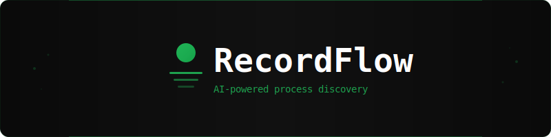
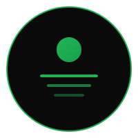

<p align="center">
  
</p>

<p align="center">
  <strong>Record how people actually work. Let AI extract every step. Get structured automation specs.</strong>
</p>

<p align="center">
  <a href="#getting-started"></a>
  <a href="#tech-stack"></a>
  <a href="#tech-stack"></a>
  <a href="#how-the-ai-pipeline-works"></a>
  <a href="LICENSE"></a>
</p>

<br/>

## What It Does

<table>
<tr>
<td width="33%" align="center">

### 1. Record

Share your screen and narrate your workflow. RecordFlow captures video, audio, screenshots, and real-time voice transcription simultaneously.

</td>
<td width="33%" align="center">

### 2. Analyze

Two AI models work together. **Gemini 2.5 Flash** watches your screen frames and extracts structured steps. **Claude Sonnet 4.6** detects gaps and generates targeted follow-up questions.

</td>
<td width="33%" align="center">

### 3. Discover

Get a complete breakdown: every step classified by automation potential, tools detected, data sources mapped, and a build spec ready for any builder.

</td>
</tr>
</table>

<br/>

## Core Features

- **Briefing System** — Paste a discovery call transcript before recording. AI extracts context, tools, pain points, and generates a watch list so it knows what to look for.
- **Screen + Voice Capture** — Browser-based recording with `getDisplayMedia` + `getUserMedia`. Web Speech API provides live transcription. No plugins needed.
- **Dual AI Pipeline** — Gemini handles vision-heavy tasks (frame analysis, step extraction) at $0.30/1M tokens. Claude handles reasoning tasks (gap detection, briefing analysis) at $3/1M tokens.
- **PII Redaction** — Frames pass through OCR-based PII detection before storage. Emails, phone numbers, credit cards, and SSNs are automatically redacted with black overlays.
- **Smart Follow-Ups** — AI spots what's missing in the recorded process and generates questions tied to specific steps.
- **Agent Instructions** — Generate structured, per-project agent instructions with confidence levels and gap warnings. Export as JSON or Markdown.
- **Build Spec Export** — Generates automation specifications with time savings estimates, complexity breakdowns, and recommendations. Export as JSON, Markdown, or PDF.
- **Analysis Progress** — Real-time 4-stage progress tracking (frames → steps → gaps → follow-ups) with error recovery and retry support.
- **Post-Recording Notes** — Add typed notes after recording finishes. Re-analyze sessions with additional context at any time.
- **Shareable Recording Links** — Send a link to anyone. They record their screen without needing an account.

<br/>

## How the AI Pipeline Works

```
                    ┌─────────────────────────────┐
                    │   Recording (every 7s)       │
                    │   Screen frames + narration   │
                    └──────────────┬──────────────┘
                                   │
                                   ▼
                    ┌─────────────────────────────┐
                    │   PII Redaction              │
                    │   OCR → detect → black-box   │
                    └──────────────┬──────────────┘
                                   │
                    ┌──────────────┴──────────────┐
                    │                              │
                    ▼                              ▼
        ┌───────────────────┐          ┌───────────────────┐
        │  Gemini 2.5 Flash │          │  Voice Narration   │
        │  Frame Analysis   │          │  Timestamp-matched  │
        └────────┬──────────┘          └────────┬──────────┘
                 │                               │
                 └───────────────┬───────────────┘
                                 │
                                 ▼
                  ┌─────────────────────────────┐
                  │  Gemini 2.5 Flash            │
                  │  Step Extraction             │
                  │  (merges frames + narration)  │
                  └──────────────┬──────────────┘
                                 │
                                 ▼
                  ┌─────────────────────────────┐
                  │  Claude Sonnet 4.6           │
                  │  Gap Detection               │
                  │  (compares vs briefing)       │
                  └──────────────┬──────────────┘
                                 │
                                 ▼
                  ┌─────────────────────────────┐
                  │  Gemini 2.5 Flash            │
                  │  Follow-Up Generation        │
                  └──────────────┬──────────────┘
                                 │
                                 ▼
                  ┌─────────────────────────────┐
                  │  Agent Instructions          │
                  │  + Build Spec Generation      │
                  └─────────────────────────────┘
```

> Narrations from voice transcription are matched to frames by timestamp proximity (10s window) before step extraction. The pipeline tracks progress across 4 stages with automatic error recovery.

<br/>

## Tech Stack

| Layer | Technology |
|:------|:-----------|
| **Framework** | Next.js 16 (App Router) / React 19 / TypeScript |
| **Styling** | Tailwind CSS v4 — dark theme, green accent `#22c55e` |
| **Database** | Supabase (PostgreSQL + Storage) |
| **AI — Vision** | Gemini 2.5 Flash ($0.30/1M tokens) |
| **AI — Reasoning** | Claude Sonnet 4.6 ($3/1M tokens) |
| **PII Detection** | tesseract.js (OCR) + sharp (image redaction) |
| **PDF Export** | @react-pdf/renderer |
| **Validation** | Zod |

<br/>

## Project Structure

```
src/
├── app/
│   ├── api/                # API routes
│   │   ├── analyze/        #   Analysis pipeline + progress
│   │   ├── projects/       #   Projects, briefings, instructions, specs
│   │   └── sessions/       #   Sessions, frames, steps, follow-ups, narrations
│   ├── dashboard/          # Project list → project detail → session detail
│   └── record/             # Browser-based recording interface
├── lib/
│   ├── ai/                 # AI providers, prompts, analysis pipeline, instructions
│   ├── pii/                # PII detection (OCR) + redaction (sharp)
│   ├── spec/               # Build spec generator + PDF export
│   ├── types.ts            # TypeScript interfaces
│   ├── validations.ts      # Zod schemas
│   └── supabase.ts         # Database client
supabase/
└── migrations/             # SQL schema (5 tables + analysis tracking)
```

<br/>

## Getting Started

### Prerequisites

- Node.js 18+
- A [Supabase](https://supabase.com) project (free tier works)
- [Anthropic API key](https://console.anthropic.com)
- [Google AI API key](https://aistudio.google.com/apikey)

### 1. Clone and install

```bash
git clone https://github.com/kaantaskentt/recordflow.git
cd recordflow
npm install
```

### 2. Set up Supabase

1. Create a new project at [supabase.com](https://supabase.com)
2. Go to **SQL Editor** and run the migration files in order:
   ```
   supabase/migrations/001_initial.sql
   supabase/migrations/002_project_tags.sql
   supabase/migrations/003_analysis_status.sql
   supabase/migrations/004_agent_instructions_and_intermediate.sql
   ```
3. Go to **Storage** and create a bucket called `recordings` (set to public)
4. Copy your Project URL and anon key from **Settings > API**

### 3. Configure environment

```bash
cp .env.local.example .env.local
```

Fill in your keys:

```env
NEXT_PUBLIC_SUPABASE_URL=your-supabase-url
NEXT_PUBLIC_SUPABASE_ANON_KEY=your-supabase-anon-key
ANTHROPIC_API_KEY=your-anthropic-api-key
GOOGLE_AI_API_KEY=your-google-ai-api-key
```

### 4. Run

```bash
npm run dev
```

Open [http://localhost:3000](http://localhost:3000). Create a project, paste a briefing transcript, create a session, record your screen, and watch the AI analysis run.

<br/>

## Browser Support

Recording requires `getDisplayMedia` and `MediaRecorder` APIs.

| Browser | Supported |
|:--------|:----------|
| Chrome | Full support |
| Edge | Full support |
| Firefox | Partial (no system audio) |
| Safari | Limited |

<br/>

## License

MIT

<br/>

<p align="center">
  
  <br/>
  <sub>Built with Gemini + Claude</sub>
</p>
